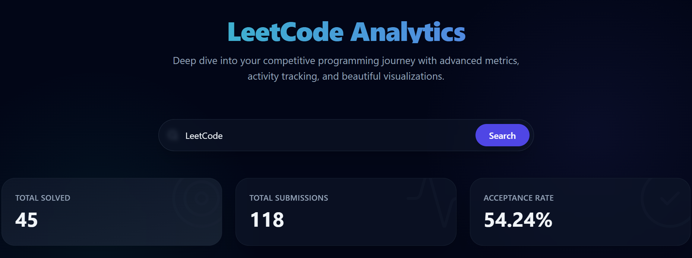
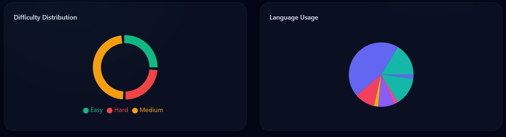
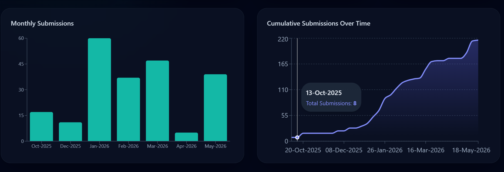

# 📊 LeetCode Analytics Dashboard

An interactive, responsive, and visually rich analytics dashboard built using **React**, **Tailwind CSS**, and **FastAPI** to analyze LeetCode problem-solving activity, submission trends, streaks, and coding language usage.

This project fetches real-time data from a public LeetCode API and presents it through beautiful Recharts, custom heatmaps, and glassmorphic analytics cards.

---

## 🚀 Live Demo

🔗 **App URL:**  
https://leetcode-analytics.vercel.app/

---

## 📸 Screenshots

### 🏠 Dashboard Overview


### 📊 Difficulty and LanguageDistribution


### 📅 Submission Trends


---

# ✨ Features

## 📈 Problem Solving Analytics
- Total solved problems
- Total submissions
- Acceptance rate
- Difficulty-wise problem count

## 💻 Programming Language Insights
- Language usage analysis
- Smooth animated pie chart visualization
- Problem-solving distribution by language

## 📅 Submission Activity Tracking
- Monthly submissions
- Weekly activity trends
- Peak activity analysis

## 🔥 Streak Analytics
- Current streak calculation
- Maximum streak tracking

## 📊 Advanced Visualizations
- Interactive **Recharts** charts
- Custom GitHub-style calendar heatmaps
- Beautiful gradient Area charts
- Bar charts & Pie charts

---

# 🛠 Tech Stack

| Component | Technology | Usage |
|---|---|---|
| **Frontend** | React (Vite) | Core UI library |
| **Styling** | Tailwind CSS v3 | Glassmorphic, responsive design |
| **Charts** | Recharts | Dynamic, animated data visualization |
| **Backend** | FastAPI | High-performance REST API |
| **Data Processing** | Python, Pandas | Data manipulation & aggregation |
| **API Handling** | Requests, Axios | Fetching data from APIs |

---

# 📂 Project Structure

```text
leetcode-dashboard/
│
├── backend/
│   ├── main.py (FastAPI application)
│   └── requirements.txt
│
├── frontend/
│   ├── src/
│   │   ├── components/ (React components like Charts, StatCard, Heatmap)
│   │   ├── App.jsx
│   │   ├── index.css (Tailwind directives)
│   │   └── main.jsx
│   ├── package.json
│   ├── tailwind.config.js
│   └── vite.config.js
│
├── README.md
├── LICENSE
└── .gitignore
```

---

# ⚙️ Installation & Usage

You need to run both the backend API and the frontend application to use the dashboard.

## 1️⃣ Clone Repository

```bash
git clone https://github.com/shivam183-star/leetcode-dashboard.git
cd leetcode-dashboard
```

---

## 2️⃣ Start the Backend (FastAPI)

Open a terminal and navigate to the `backend` directory:

```bash
cd backend
pip install -r requirements.txt
python -m uvicorn main:app --reload --port 8000
```

The API will start running at `http://localhost:8000`.

---

## 3️⃣ Start the Frontend (React + Vite)

Open a **new** terminal and navigate to the `frontend` directory:

```bash
cd frontend
npm install
npm run dev
```

The React app will typically be accessible at `http://localhost:5173`. Open this URL in your browser, enter a LeetCode username, and view the analytics!

---

# 🌐 API Used

This project uses the public LeetCode API to fetch data which the backend then processes:

```text
https://alfa-leetcode-api.onrender.com
```

### Endpoints Used
- `/solved`
- `/language`
- `/calendar`

---

# 🎯 Future Improvements

Planned upgrades for future versions:

- Contest analytics
- Contest rating progression graph
- User profile section
- Topic-wise solved problems

---

# 🤝 Contributing

Contributions are welcome. If you'd like to improve this project:

1. Fork the repository
2. Create a feature branch
3. Commit your changes
4. Push the branch
5. Open a Pull Request

---

# 📄 License

This project is licensed under the [MIT License](LICENSE).

---

# 👨‍💻 Author

## Shivam Singh

### Connect with Me
- [GitHub](https://github.com/shivam183-star)
- [LinkedIn](https://www.linkedin.com/in/shivam-singh-15b79a31a/)

---

# ⭐ Support

If you found this project useful:
- Give it a ⭐ on GitHub
- Share it with others
- Fork the repository

---

# 📌 Note

This project is intended for educational and portfolio purposes.
LeetCode data belongs to their respective owners.
